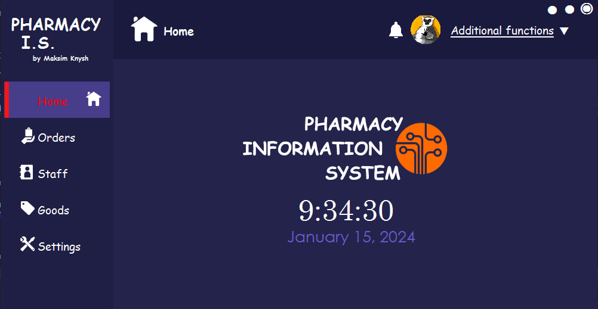
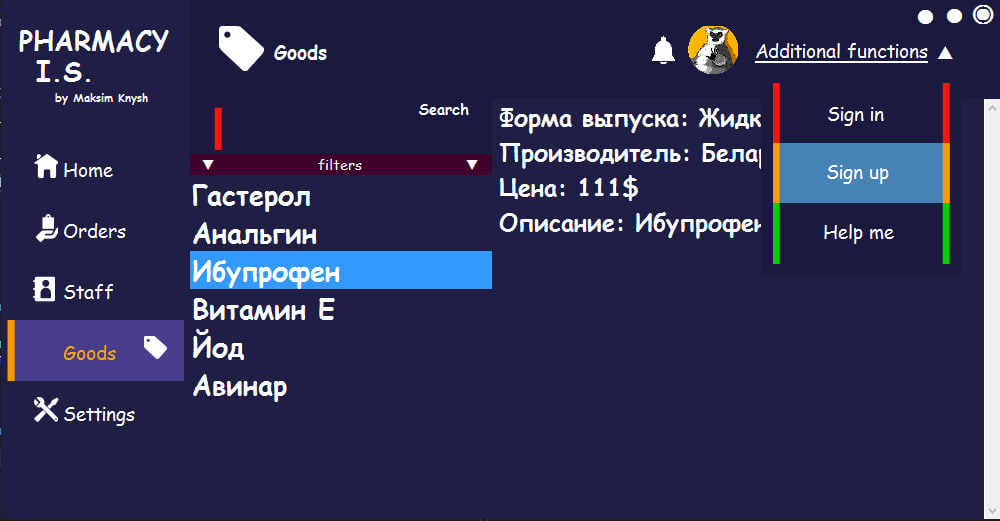

<h1 align="center">Hi there!</a> 
<h3 align="center">The system for customers in pharmacies that helps to obtain information about the drugs they need. The work includes working with a database, a well-designed interface based on WF and search filters.</h3>
  <h4 align="center">❗PLEASE NOTE. I wrote the application a long time ago, when I didn’t know the language well enough! => UGLY AND REPEATING CODE❗<h4>
  <h2 align="center">Keywords: WINDOWS FORMS, C#, .NET, WINDOWS</h2>

